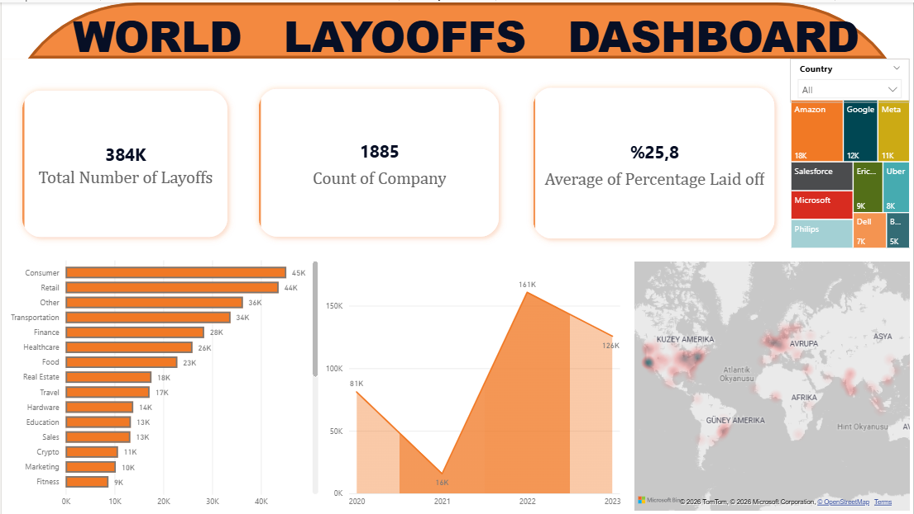

# 📊 Dünya Çapında İşten Çıkarmalar: Veri Temizleme ve Keşifsel Veri Analizi (EDA) (SQL) 

Bu proje, 2020-2023 yılları arasındaki küresel teknoloji işten çıkarmalarını içeren ham bir veri setinin **SQL** kullanılarak temizlenmesi ve analiz edilmesi sürecini kapsamaktadır. Proje, ham verinin analiz edilebilir hale getirilmesinden, stratejik iş çıkarımlarının yapılmasına kadar uçtan uca bir veri analitiği sürecidir.

---

## 🛠️ 1. Veri Temizleme Süreci (Data Cleaning)

Analizlerin doğruluğunu sağlamak için ham veri seti üzerinde şu teknik işlemler uygulanmıştır:

* **Mükerrer Kayıtlar (Duplicates):** `ROW_NUMBER()` ve `CTE` kullanılarak tamamen aynı olan satırlar tespit edilmiş ve mükerrer veriler temizlenmiştir.
* **Standardizasyon:** * `Industry` sütunundaki "Crypto" ve "Crypto Currency" gibi farklı girilmiş veriler tek bir başlık altında birleştirilmiştir. * Ülke isimlerindeki yazım hataları ve gereksiz noktalama işaretleri düzeltilmiştir.
* **Zaman Verisi Düzenleme:** Metin formatındaki tarih verileri, zaman serisi analizine uygun hale getirilmesi için `STR_TO_DATE` ile `Date` formatına dönüştürülmüştür.
* **Null Değer Yönetimi:** Toplam işten çıkarma ve oran sütunlarındaki eksik veriler (NULL) incelenmiş; analizi saptırabilecek anlamsız kayıtlar temizlenmiştir.

---

## 📈 2. Temel Bulgular ve Analitik Çıkarımlar

### A. Şirket ve Yatırım İlişkisi
* **Devlerin Küçülmesi:** İşten çıkarmalarda başı çeken ilk 3 dev: **Amazon (18.000+), Google (12.000) ve Meta (11.000)** olmuştur.
* **Yatırım Tezatlığı:** Meta 26 Milyar $nakit gücüne rağmen 11.000 kişiyi çıkarırken, Salesforce çok daha düşük bir yatırımla (65 Milyon$) benzer seviyede (10.090) işten çıkarma yapmıştır.
* **Çıkarım:** Yüksek yatırım almış olmak veya dev bir şirket olmak işten çıkarmalara karşı bir kalkan değildir; aksine en büyük operasyonel daralmayı bu devler gerçekleştirmiştir.

### B. Zaman Serisi ve Krizin Zirvesi
* **Rekor Seviye:** Krizin zirve noktası **Ocak 2023** tarihinde **84.714** işten çıkarma ile görülmüştür.
* **Analiz:** 2020-2021 dönemindeki düşük sayılar, pandeminin yarattığı yapay büyüme ve aşırı istihdamın sonucudur. Ocak 2023 zirvesi, bu kontrolsüz büyümenin ekonomik daralma ile dengelenme sürecidir.

### C. Sektörel Darbe
* **En Çok Etkilenenler:** **Consumer** ve **Retail** sektörleri toplamda **88.000'den fazla** kayıpla krizden en ağır etkilenen alanlar olmuştur. Bu durum, küresel daralmanın doğrudan tüketici harcamalarını vurduğunu kanıtlar.
* **Crypto Sektörü:** Veri temizleme aşamasında standardize edilen veriler sayesinde, bu sektördeki gerçek kaybın (10.693 kişi) net raporlanması sağlanmıştır.

### D. Coğrafi Dağılım
* **Merkez Üssü:** İşten çıkarmaların merkezi **256.000'den fazla** kayıpla açık ara **ABD**'dir. 
* **Domino Etkisi:** ABD'yi Hindistan ve Avrupa (Hollanda, İsveç) pazarlarının takip etmesi, krizin küresel teknoloji merkezleri arasında yayıldığını belgelemektedir.

### E. Şirket Aşaması (Stage) Analizi
* **Hacim vs. Oran:** Sayısal olarak en büyük kaybı **Post-IPO** (Halka arz edilmiş) devler verirken; oransal olarak **Seed** aşamasındaki girişimler ekiplerinin ortalama **%70'ini** kaybetmiştir.
* **Çıkarım:** Kriz devler için bir "maliyet optimizasyonu" iken, küçük girişimler için bir "hayatta kalma mücadelesine" dönüşmüştür.

---

## 💻 Kullanılan Teknolojiler ve Teknikler
* **Database:** MySQL
* **Language:** SQL
* **Techniques:** CTE's, Window Functions (ROW_NUMBER), Joins, Data Standardization, Date Formatting, Aggregations.

---

## 📂 Proje Dosyaları
* `data_cleaning.sql`: Ham veriyi temizlemek için kullanılan tüm sorgular.
* `exploratory_analysis.sql`: Yukarıdaki analitik bulguları elde etmek için yazılan sorgular.
* `Raw_Data.csv`: Analizde kullanılan dünya genelindeki işten çıkarmaları içeren ham veri seti.
